# KnowledgeGPT 🧠⚡

<p align="center">
  <strong>Production-Ready Retrieval-Augmented Generation (RAG) Platform</strong><br>
  Turn PDFs, websites, and raw notes into living knowledge bases. Chat with your data using Google Gemini with verifiable source citations and streaming answers.
</p>

<p align="center">
  
  
  
  
  
  
  
  
</p>

---

## 📖 Overview

**KnowledgeGPT** is an end-to-end, full-stack AI knowledge platform. It decouples document ingestion from the user-facing web server using asynchronous background worker queues, stores 768-dimensional embeddings in a Qdrant vector database, and streams answers grounded strictly in retrieved context with precise document citations.

---

## 🏗️ Architecture & RAG Pipeline

```mermaid
flowchart TD
    subgraph INGESTION["1. Document Ingestion & Vector Pipeline"]
        A["User Uploads PDF / URL / Text"] --> B["Express API (/api/v1/sources)"]
        B --> C["Extract Content & Chunking (LangChain Recursive Splitter)"]
        C --> D["Store Chunks in MongoDB"]
        D --> E["Push Job to Redis (BullMQ Queue)"]
        E --> F["Background Worker (document-processing.worker.js)"]
        F --> G["Google Gemini Embeddings (text-embedding-004)"]
        G --> H[("Qdrant Vector Database")]
        F --> I["Update Source Status: ready"]
    end

    subgraph QUERY["2. Semantic Retrieval & Streaming Generation"]
        J["User Asks Question"] --> K["Chat Endpoint (/api/v1/chat/stream)"]
        K --> L["Embed Query (text-embedding-004)"]
        L --> M["Vector Search in Qdrant (Cosine Similarity + Filter by KB ID)"]
        M --> N["Retrieve Relevant Chunks & Citations"]
        N --> O["Inject Context into System Prompt"]
        O --> P["Google Gemini Stream (gemini-3.5-flash / gemini-3.8-flash)"]
        P --> Q["Server-Sent Events / Stream Reader"]
        Q --> R["React UI (Live Markdown Rendering + Citation Modals)"]
    end
```



---

## ✨ Key Features

* 📚 **Multi-Source Ingestion:** Ingest raw text snippets, PDF documents (via `pdf-parse`), and live website URLs (scraped via `cheerio`).
* ⚡ **Asynchronous Background Processing:** Heavy extraction, chunking, and embedding workflows are offloaded to a dedicated **BullMQ worker** backed by **Redis** to eliminate API timeouts.
* 🎯 **Precise Vector Search:** Powered by **Qdrant**, with per-knowledge-base payload filtering and cosine similarity matching.
* 🤖 **State-of-the-Art AI:** Embeddings generated via Google's fast **`text-embedding-004`** model; answers generated with **Gemini Flash** using multi-model resilience.
* 💬 **Real-time Streaming Chat:** Token-by-token response streaming directly to the client with inline markdown rendering and source citation inspect modals.
* 🔐 **Secure Authentication:** Complete authentication with JWT stored in secure `HttpOnly` cookies, password hashing with `bcryptjs`, and route protection.
* 🌓 **Polished Responsive Interface:** Built with React 19, Redux Toolkit, Tailwind CSS v4, Lucide icons, theme toggle, and custom toast notifications.

---

## 🛠️ Tech Stack

| Area | Technologies |
| :--- | :--- |
| **Frontend** | React 19, Vite 8, Tailwind CSS v4, Redux Toolkit, React Router v7, Lucide Icons, React Hot Toast |
| **Backend** | Node.js, Express 5 (ES Modules), Cookie Parser, CORS, Dotenv |
| **Database** | MongoDB Atlas (Mongoose ODM) |
| **Queue / Cache**| Redis, BullMQ, IORedis |
| **Vector DB** | Qdrant (Cloud / REST Client `@qdrant/js-client-rest`) |
| **AI / Embeddings** | `@google/genai` (`text-embedding-004`, `gemini-3.5-flash`) |
| **Document Tools** | `@langchain/textsplitters`, `pdf-parse`, `cheerio`, `axios` |

---

## 📂 Project Structure

```text
KnowledgeGPT/
├── client/                               # Frontend Application
│   ├── public/
│   │   ├── favicon.svg                   # Custom KnowledgeGPT favicon
│   │   └── ...
│   ├── src/
│   │   ├── api/                          # Axios API clients & streaming service
│   │   ├── components/
│   │   │   ├── auth/                     # Auth forms & layouts
│   │   │   ├── chat/                     # MarkdownRenderer, CitationViewerModal
│   │   │   ├── knowledgeBase/            # KB cards & modals
│   │   │   ├── layout/                   # AppLayout, Navbar, Sidebar
│   │   │   └── SourceManager.jsx         # Upload PDFs, text, and URLs
│   │   ├── pages/                        # Home, AuthPage, KnowledgeBase, Chat
│   │   ├── store/                        # Redux slices & async thunks
│   │   ├── App.jsx                       # Routing & App root
│   │   └── main.jsx
│   ├── vercel.json                       # SPA route rewrite configuration
│   └── package.json
│
└── server/                               # Backend Application & Worker
    ├── src/
    │   ├── controllers/                  # Auth, KnowledgeBase, Source, Chat
    │   ├── models/                       # User, KnowledgeBase, Source, Chunk
    │   ├── queues/                       # BullMQ queue configurations
    │   ├── routes/                       # Express router definitions
    │   ├── services/
    │   │   ├── chunking.service.js       # Text splitting logic
    │   │   ├── document-processing.service.js # Chunking & embedding workflow
    │   │   ├── embedding.service.js      # Google text-embedding-004 wrapper
    │   │   ├── generation.service.js     # Gemini streaming answer generator
    │   │   ├── qdrant.service.js         # Collection management & vector search
    │   │   ├── retrieval.service.js      # Semantic search pipeline
    │   │   └── extractors/               # PDF and web scraping services
    │   ├── utils/                        # MongoDB, Redis, Qdrant, Gemini configs
    │   └── workers/
    │       └── document-processing.worker.js # BullMQ Background worker
    ├── server.js                         # Main Express API entry point
    └── package.json
```

---

## 🚀 Getting Started

### Prerequisites

* [Node.js](https://nodejs.org/) (v18+)
* [MongoDB](https://www.mongodb.com/) (Local or MongoDB Atlas cluster)
* [Redis](https://redis.io/) (Local instance or cloud Redis instance)
* [Qdrant](https://qdrant.tech/) (Qdrant Cloud cluster or local Docker container)
* [Google AI Studio API Key](https://aistudio.google.com/)

---

### Installation

1. **Clone the repository:**
   ```bash
   git clone https://github.com/anubhav-2212/KnowledgeGPT.git
   cd KnowledgeGPT
   ```

2. **Install Backend Dependencies:**
   ```bash
   cd server
   npm install
   ```

3. **Install Frontend Dependencies:**
   ```bash
   cd ../client
   npm install
   ```

---

### Environment Variables

#### Backend (`server/.env`)
Create a `.env` file inside the `server/` directory:

```env
PORT=4000
NODE_ENV=development
CLIENT_URL=http://localhost:5173

# Database & Auth
MONGODB_URI=mongodb+srv://<username>:<password>@cluster0.mongodb.net/knowledgegpt?retryWrites=true&w=majority
JWT_SECRET=your_super_secret_jwt_key

# Redis (Local or Cloud)
REDIS_URL=redis://localhost:6379

# Qdrant Vector Database
QDRANT_URL=https://<your-cluster>.cloud.qdrant.io:6333
QDRANT_API_KEY=your_qdrant_api_key
QDRANT_COLLECTION_NAME=knowledgebase

# Google Gemini
GEMINI_API_KEY=your_google_gemini_api_key
```

#### Frontend (`client/.env`)
Create a `.env` file inside the `client/` directory:

```env
VITE_API_URL=http://localhost:4000/api/v1
```

---

### Running Locally

To run the complete stack locally, start the API server, worker, and frontend:

1. **Start Backend Server & Worker:**
   ```bash
   cd server
   # In terminal 1:
   npm run dev

   # In terminal 2:
   npm run worker
   ```

2. **Start Frontend Client:**
   ```bash
   cd client
   # In terminal 3:
   npm run dev
   ```

Open your browser at `http://localhost:5173`.

---

## 🚢 Deployment

### 1. Deploy Frontend on [Vercel](https://vercel.com/)
1. Import repository and set **Root Directory** to `client`.
2. Framework Preset: **Vite**.
3. Environment Variables:
   * `VITE_API_URL`: `https://<your-render-backend-url>/api/v1`
4. The included `client/vercel.json` ensures client-side routes (SPA) load correctly without 404s.

### 2. Deploy Backend on [Render](https://render.com/)
1. Create a **Web Service** and set **Root Directory** to `server`.
2. Build Command: `npm install`
3. Start Command:
   ```bash
   npm run start & npm run worker:prod
   ```
4. Set Environment Variables:
   * `PORT`: `4000`
   * `MONGODB_URI`: `<Atlas Connection String>`
   * `JWT_SECRET`: `<Secret>`
   * `REDIS_URL`: `<Render Internal Redis URL>`
   * `QDRANT_URL`: `<Qdrant Cloud URL>`
   * `QDRANT_API_KEY`: `<Qdrant API Key>`
   * `QDRANT_COLLECTION_NAME`: `knowledgebase`
   * `GEMINI_API_KEY`: `<Gemini API Key>`
   * `CLIENT_URL`: `https://<your-vercel-app>.vercel.app`

---

## 📡 Core API Reference

| Method | Endpoint | Description | Auth Required |
| :--- | :--- | :--- | :---: |
| `POST` | `/api/v1/auth/register` | Register new user | No |
| `POST` | `/api/v1/auth/login` | Login user & set cookie | No |
| `POST` | `/api/v1/auth/logout` | Clear auth token | Yes |
| `GET` | `/api/v1/auth/me` | Fetch active session profile | Yes |
| `GET` | `/api/v1/knowledge-base` | List all user knowledge bases | Yes |
| `POST` | `/api/v1/knowledge-base` | Create knowledge base | Yes |
| `POST` | `/api/v1/sources/text` | Add raw text source & enqueue | Yes |
| `POST` | `/api/v1/sources/pdf` | Upload PDF file & enqueue | Yes |
| `POST` | `/api/v1/sources/website` | Scrape URL content & enqueue | Yes |
| `GET` | `/api/v1/sources/kb/:kbId` | Get sources and processing status | Yes |
| `POST` | `/api/v1/chat/stream` | Stream RAG answer with citations | Yes |

---

## 📄 License

This project is licensed under the [MIT License](LICENSE).
